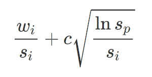

# MCTSTicTacToe
Tic-tac-toe game in which the computer plays using a Monte Carlo tree search.

Computer plays optimally and does not lose. If you beat the computer somehow, please open an issue and paste the game log.

## Monte Carlo tree search explained

The Monte Carlo tree search algorithm relies on a tree data structure consisting of nodes representing states of the game. A node is a child of another node if and only if the game state stored in the child node can be achieved by making one move on the parent node's game state.

Initially, the tree is small, consisting only of a single node, and as the algorithm runs, it grows in size as the algorithm explores possible game states. Note that a leaf node does not necessarily entail the end of a game; it could simply be that the algorithm has not explored any game states beyond that node.

Each node stores information used by the algorithm.

- the state of the game at that node
- the side that is allowed to make a move at that state
- the number of times the algorithm has visited the node
- the number of times the algorithm has won after visiting the node
- the parent of the node
- the children of the node

In this implementation of MCTS, other information is stored that is specific to this implementation and could be handled in different ways in other implementations.

- the move on the parent's state that resulted in the node (i.e. what move led to this node's state)
- whether the node has been expanded (more on expansion later)

Every time the computer needs to make a move, the root of the tree is set to the node that represents the current game state and the following four phases are repeated until the algorithm exceeds a certain amount of time or computational resources.

**1. Selection**

In the selection phase, the algorithm begins at the root node, and takes a path through successive child nodes until it reaches a leaf. The child node that is chosen is the child with the greatest Upper Confidence bounds applied to Trees (UCT) value, which is given by

where

- *wi* is the win score of the node, usually a count of how many times games through that node win
- *si* is the number of times the node has been visited
- *c* is a constant used to adjust the exploration vs exploitation trade-off, usually set to `sqrt(2)`
- *sp* is the number of times the node's parent has been visited

The UCT value balances exploration and exploitation, favoring both nodes that tend to win and unexplored nodes to ensure that the best node is chosen *and* every node is well-represented.

**2. Expansion**

In the expansion phase, the algorithm takes the leaf that was found in selection and adds to its children new nodes containing all possible game states that can be obtained by making one move on the former leaf's game state. The algorithm then returns a random child of the former leaf.

**3. Simulation/Rollout**

In the simulation phase (also called the rollout phase), the algorithm takes the random child obtained from expansion and plays out its game state using completely random moves until the game ends. The algorithm then records the outcome of the random play (in this implementation, either a win, loss, or tie).
    
**4. Backpropagation**

In the backpropagation phase, the algorithm begins at the node that rollout occurred at and increments its visit count. If the node's side is the opposite of the computer's side, then the node's win count is updated (in this implementation, the win count is incremented on a win, increased by 0.5 on a tie, and decremented on a loss). The reason that only opposite sides have their win counts updated is because when the algorithm is selecting a move, the move incurs a game state in which the opposite side is moving. The process of updating visit counts and win counts is repeated on the successive parents of the node until the root is reached.

The 4 phases of the algorithm are repeated until the algorithm has exceeded a limit on runtime and/or computational resources. At that point, the algorithm selects the move that will lead it to the child of the root with the highest win count / times visited ratio.
